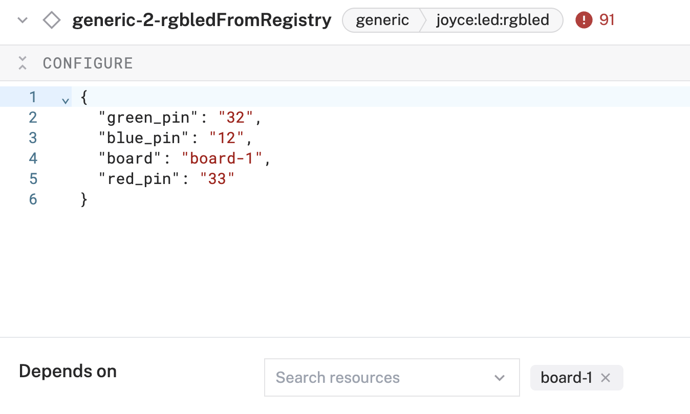
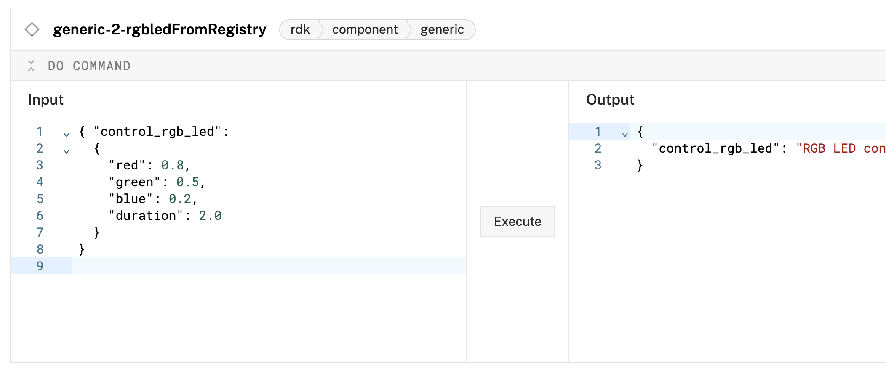

### RGB LED

This module implements the [rdk generic API](https://docs.viam.com/appendix/apis/components/generic/) in a `joyce:rgb:rgbled` model.

With this model, you can control an RGB LED.

### Build and Run

To use this module, follow these instructions to [add a module from the Viam Registry](https://docs.viam.com/registry/configure/#add-a-modular-resource-from-the-viam-registry) and select the `joyce:rgb:rgbled` model from the [`rgb`](https://app.viam.com/module/joyce/rgb) module.

### Configure your service

> [!NOTE]  
> Before configuring your sensor, you must [create a machine](https://docs.viam.com/cloud/machines/#add-a-new-machine).

- Navigate to the **CONFIGURE** tab of your robot’s page in [the Viam app](https://app.viam.com/).
- Click on the **+** icon in the left-hand menu and select **Component**.
- Select the `generic` type, then select the `rgbled` module.
- Enter a name for your component and click **Create**.
- On the new component panel, copy and paste the following attribute template into your component’s **CONFIGURE** field. And select the board under the **Depends on** field.

```json
{
  "red_pin": <string>,
  "blue_pin": <string>,
  "green_pin": <string>,
  "board": <string>
}
```

The following attributes are available for the `joyce:rgb:rgbled` component:

| Name        | Type  | Inclusion | Description                            |
| ----------- | ----- | --------- | -------------------------------------- |
| `red` | string | Required | A string representing the physical pin on your board connected to the red lead of a common cathode RGB LED. The string must contain only digits, such as `"33"`  |
| `blue_pin` | string | Required | A string representing the physical pin on your board connected to the blue lead of a common cathode RGB LED. The string must contain only digits, such as `"12"`  |
| `green_pin` | string | Required | A string representing the physical pin on your board connected to the green lead of a common cathode RGB LED. The string must contain only digits, such as `"32"`  |
| `board`     | string | Required | Name of the board (to access GPIO pin) according to the Viam app, such as `board-1` |
- 

### Do Command
On the **CONTROL** tab, select your RGB LED component, and use the following DoCommands: `control_rgb_led` or `ripple` formatted like the following.

```json
{
    "control_rgb_led": {
        "red": 0.8,
        "green": 0.5,
        "blue": 0.2,
        "duration": 2.0
    }
}

````

```json
{
  "ripple": {
    "duration": 7.0
  }
}
```


> [!NOTE]  
> For more information, see [Configure a Robot](https://docs.viam.com/manage/configuration/).
